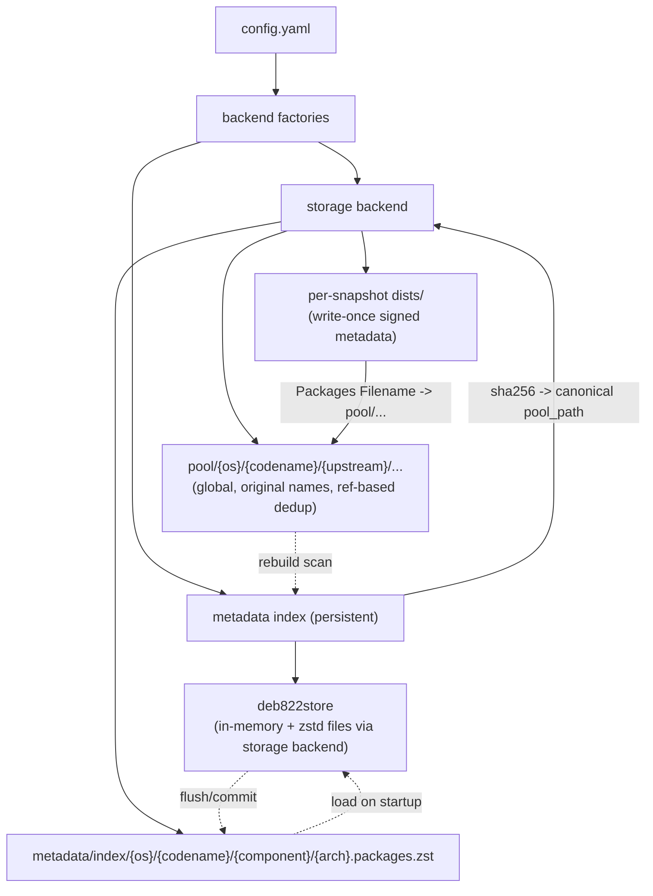

# Architecture

## Component diagram



## Storage layout

Two namespaces share one storage root (filesystem directory or S3 prefix):

**`pool/`** -- global file store. One copy of each `.deb`, keyed by
`pool/{os}/{codename}/{upstream}/{section}/{letter}/{name}/{filename}`, preserving
the original Debian filename. Shared across all snapshots; never duplicated per
snapshot.

**Per-snapshot `dists/`** -- write-once signed metadata only. Each snapshot lives
under `{snapshot-id}/{os}/dists/{codename}/`. `Packages` entries point at the global
pool via relative `Filename:` paths. `current/{os}` is a small text file containing
the current snapshot ID.

**`metadata/`** -- index files backing the in-memory deb822store:
`metadata/index/{os}/{codename}/{component}/{arch}.packages.zst` and
`metadata/upstream/{upstream}.state.zst`.

Example on-disk layout:

```
root/
  pool/debian/trixie/debian-security/main/a/apt/apt_2.6.1_amd64.deb
  2026-06-29/debian/dists/trixie/InRelease
  2026-06-29/debian/dists/trixie/main/binary-amd64/Packages.gz
  current/debian                           # contains "2026-06-29"
  keys/debproxy.asc
  keys/ABCDEF1234....asc
  metadata/index/debian/trixie/main/amd64.packages.zst
  metadata/upstream/debian-main.state.zst
```

On S3 these are simply key prefixes within the configured bucket/prefix.

## URL routing

| URL pattern | Served by |
|---|---|
| `/live/{os}/{codename}/dists/...` | Dynamically generated, merged from all upstreams; cached in memory for 5 minutes |
| `/live/{os}/{codename}/pool/...` | Pool file with lazy pull-through from upstream |
| `/current/{os}/dists/...` | Resolves to newest published snapshot |
| `/{snapshot-id}/{os}/dists/...` | Reads from `{snapshot-id}/{os}/dists/...` in storage |
| `/{date}/{os}/dists/...` | Resolves to newest snapshot with timestamp <= date |
| `/{selector}/{os}/pool/...` | Pool file (no pull-through for pinned snapshots) |
| `/keys/...` | Published signing key files |
| `/healthz` | Always 200 OK |

## Package layout

```
cmd/debproxy/main.go          -- CLI: serve, rebuild, update, snapshot, prime, publish-key, healthcheck
internal/
  apt/                        -- deb822 parse/write, Release parsing, Packages stanza builder, dep parser
  avail/                      -- merge upstreams per codename (highest version wins), dep closure
  config/config.go            -- typed config structs, Load(), env overrides, layout resolution, keyring load
  debversion/                 -- dpkg version comparison
  deb/                        -- .deb ar container reading (control.tar extraction)
  ingest/                     -- download + verify + store .deb, record IndexEntry
  metadata/
    metadata.go               -- MetadataIndex interface
    deb822store/store.go      -- in-memory index backed by zstd deb822 files; Flush/Refresh/merge-before-write
  metadatafactory/factory.go  -- always returns deb822store.Store
  model/model.go              -- domain types: Digest, Checksums, IndexEntry, UpstreamSource, Layout, ...
  publish/                    -- generate Packages (plain/gz/zst), Release, InRelease, Release.gpg
  rebuild/rebuild.go          -- scan pool/, parse .deb control, repopulate index
  server/
    server.go                 -- HTTP handler: snapshot/live/pool/keys routing, pull-through
    middleware.go             -- Apache Combined Log Format access logging, response compression
  signing/signing.go          -- load private key, sign/verify InRelease and Release.gpg, publish public key
  storage/
    storage.go                -- Storage interface (FileStore + Publisher)
    filesystem/fs.go          -- filesystem backend: atomic write, keep-first, chmod 0644
    s3store/s3.go             -- S3 backend: IfNoneMatch keep-first, ACL/Cache-Control/Content-Type per path
  storagefactory/factory.go   -- New(cfg) switch on storage.backend
  syncer/syncer.go            -- Prime, Update (auto_update refresh), Snapshot (publish + set current)
  upstream/
    fetch.go                  -- fetch + GPG-verify InRelease/Release, SHA256-verify Packages and .deb
    cache.go                  -- IndexCache: ETag/304 conditional re-fetch, Cache-Control expiry
    transport.go              -- tuned HTTP client, 3 retries on 5xx with idle-connection flush
```

## Dependencies

All compression and cryptography runs in-process; no external binaries (`gpg`, `zstd`,
`xz` CLI) are ever invoked.

| Package | Purpose |
|---|---|
| `github.com/klauspost/compress` | gzip + zstd for generated indexes, metadata files, .deb control reading |
| `github.com/ProtonMail/go-crypto/openpgp` | load keyrings, verify InRelease/Release.gpg, sign snapshots |
| `github.com/blakesmith/ar` | read the `ar` container of `.deb` files during rebuild |
| `github.com/aws/aws-sdk-go-v2` | S3 storage backend |
| `gopkg.in/yaml.v3` | config parsing |
| stdlib `log/slog` | structured application logging |

## Containerization

The binary is built statically (`CGO_ENABLED=0`) and runs on a minimal distroless
image as a non-root user.

```dockerfile
FROM golang:1.26 AS build
WORKDIR /src
COPY go.mod go.sum ./
RUN go mod download
COPY . .
RUN CGO_ENABLED=0 go build -trimpath -ldflags="-s -w" -o /out/debproxy ./cmd/debproxy

FROM gcr.io/distroless/static-debian12:nonroot
COPY --from=build /out/debproxy /usr/local/bin/debproxy
EXPOSE 8080
USER nonroot:nonroot
ENTRYPOINT ["debproxy"]
CMD ["serve", "--config", "/etc/debproxy/config.yaml"]
```

## Kubernetes

Manifests live under `deploy/k8s/` and are applied with kustomize. Public keyrings
are non-sensitive and live in a ConfigMap; only the private signing key is in a Secret:

```
deploy/k8s/namespace.yaml   -- debproxy namespace
deploy/k8s/configmap.yaml   -- config.yaml at /etc/debproxy/config.yaml
deploy/k8s/keyrings.yaml    -- public upstream keyrings (ConfigMap) at /etc/debproxy/keys/
deploy/k8s/secret.yaml      -- private signing key (Secret) at /etc/debproxy/signing/
deploy/k8s/pvc.yaml         -- ReadWriteOnce volume at /var/lib/debproxy (filesystem backend)
deploy/k8s/deployment.yaml  -- single replica, liveness/readiness on /healthz, nonroot
deploy/k8s/service.yaml     -- ClusterIP on port 8080
deploy/k8s/ingress.yaml     -- ingress for apt clients
```

**Scaling:** the filesystem backend with an RWO PVC requires `replicas: 1` and a
`Recreate` update strategy. To run multiple replicas, switch to the S3 backend (no
PVC, scales freely) or back the PVC with an RWX volume (NFS/EFS).
